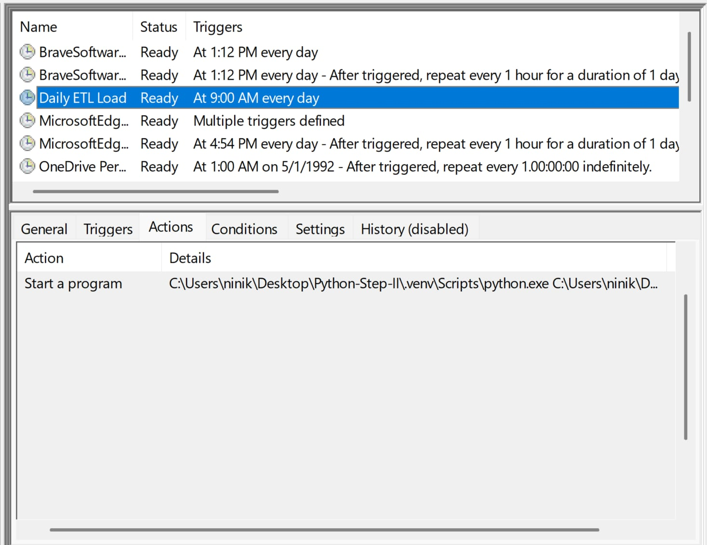

*Automation with Windows Task Scheduler

- Daily ETL script runs automatically at 9:00 AM.
- Configured in Windows Task Scheduler:
  - Task Name: Daily ETL Load
  - Trigger: Every day at 09:00
  - Action: Start a program
      - Program/script: C:\Users\ninik\Desktop\Python-Step-II\.venv\Scripts\python.exe
      - Arguments: C:\Users\ninik\Desktop\Python-Step-II\etl\load.py

i have presented here the image of Task scheduler 
